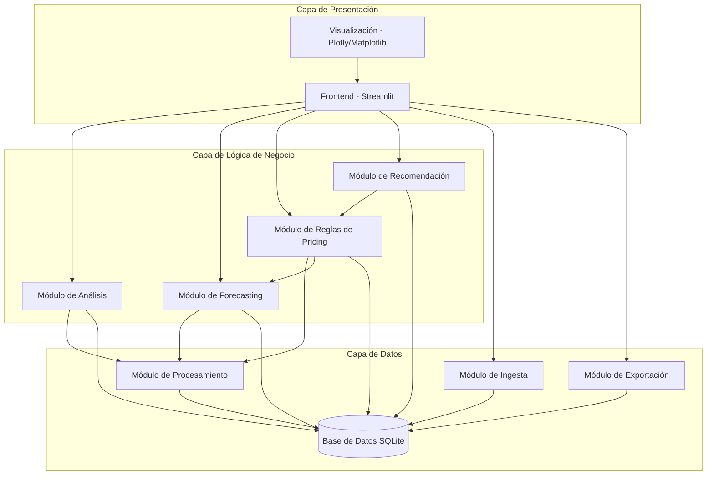
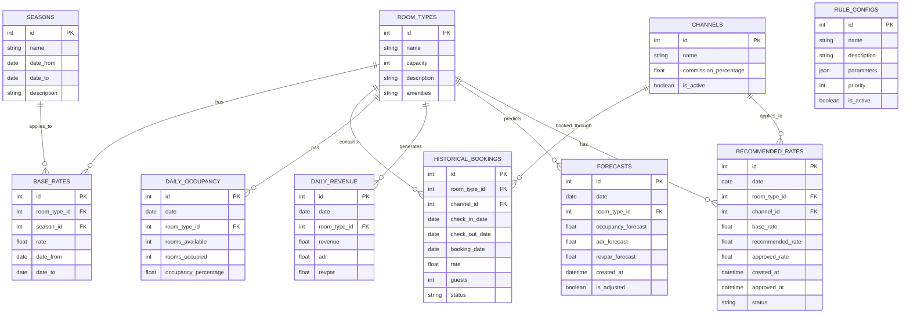
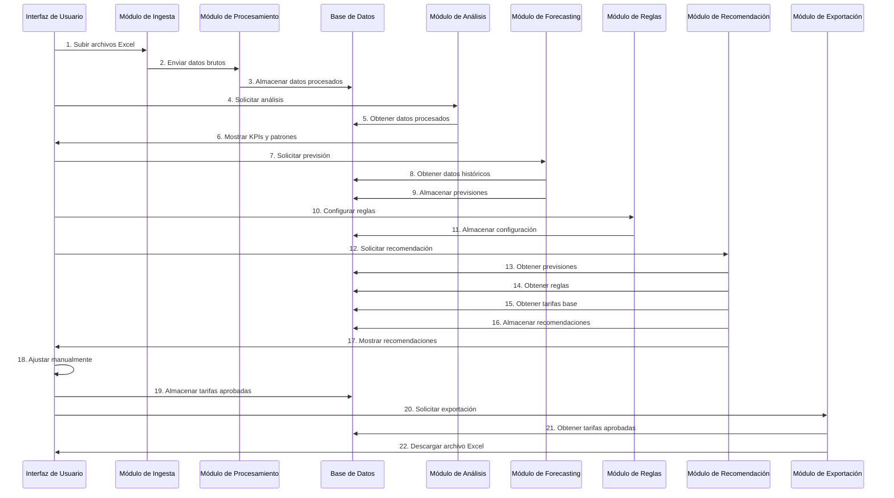

# Arquitectura del Framework de Revenue Management - Hotel Playa Club (MVP)

Este documento describe la arquitectura propuesta para el Framework de Revenue Management del Hotel Playa Club (MVP), basado en los requisitos especificados en el PRD y el documento de tareas pendientes.

## Índice

1. [Diagrama de Arquitectura](#1-diagrama-de-arquitectura)
2. [Estructura de Directorios](#2-estructura-de-directorios)
3. [Esquema de la Base de Datos](#3-esquema-de-la-base-de-datos)
4. [Patrones de Diseño](#4-patrones-de-diseño)
5. [Estrategia de Modularidad](#5-estrategia-de-modularidad)
6. [Flujo de Datos](#6-flujo-de-datos)

## 1. Diagrama de Arquitectura

La arquitectura sigue un enfoque basado en capas para mantener una clara separación de responsabilidades:



### Componentes Principales

1. **Capa de Presentación**:
   - **Frontend (Streamlit)**: Interfaz de usuario para interactuar con el sistema.
   - **Visualización (Plotly/Matplotlib)**: Componentes para visualizar datos y resultados.

2. **Capa de Lógica de Negocio**:
## 2. Estructura de Directorios

```
revenue_management/
│
├── app.py                      # Punto de entrada principal de la aplicación
├── config.py                   # Configuración global de la aplicación
├── requirements.txt            # Dependencias del proyecto
├── README.md                   # Documentación general
│
├── data/                       # Directorio para archivos de datos
│   ├── raw/                    # Datos brutos importados
│   ├── processed/              # Datos procesados
│   └── exports/                # Tarifas exportadas
│
├── db/
│   ├── schema.py               # Definición del esquema de la base de datos
│   ├── database.py             # Gestión de conexiones a la base de datos
│   └── migrations/             # Scripts de migración de la base de datos
│
├── models/                     # Modelos de datos y entidades
│   ├── __init__.py
│   ├── room.py                 # Modelo para habitaciones
│   ├── booking.py              # Modelo para reservas
│   ├── rate.py                 # Modelo para tarifas
│   ├── forecast.py             # Modelo para previsiones
│   └── rule.py                 # Modelo para reglas
│
├── services/                   # Lógica de negocio
│   ├── __init__.py
│   ├── data_ingestion/         # Servicios de ingesta de datos
│   │   ├── __init__.py
│   │   ├── excel_reader.py     # Lectura de archivos Excel
│   │   └── data_cleaner.py     # Limpieza y normalización de datos
│   │
│   ├── data_processing/        # Servicios de procesamiento de datos
│   │   ├── __init__.py
│   │   ├── occupancy.py        # Procesamiento de datos de ocupación
│   │   └── revenue.py          # Procesamiento de datos de ingresos
│   │
│   ├── analysis/               # Servicios de análisis
│   │   ├── __init__.py
│   │   ├── kpi_calculator.py   # Cálculo de KPIs
│   │   └── pattern_analyzer.py # Análisis de patrones
│   │
│   ├── forecasting/            # Servicios de previsión
│   │   ├── __init__.py
│   │   ├── prophet_model.py    # Modelo de previsión con Prophet
│   │   └── forecast_adjuster.py # Ajuste manual de previsiones
│   │
│   ├── pricing/                # Servicios de pricing
│   │   ├── __init__.py
│   │   ├── rule_engine.py      # Motor de reglas de pricing
│   │   └── rate_calculator.py  # Cálculo de tarifas recomendadas
│   │
│   └── export/                 # Servicios de exportación
│       ├── __init__.py
│       └── excel_exporter.py   # Exportación a Excel
│
├── ui/                         # Interfaz de usuario
│   ├── __init__.py
│   ├── pages/                  # Páginas de la aplicación
│   │   ├── __init__.py
│   │   ├── dashboard.py        # Dashboard principal
│   │   ├── data_import.py      # Página de importación de datos
│   │   ├── analysis.py         # Página de análisis
│   │   ├── forecasting.py      # Página de previsión
│   │   ├── pricing.py          # Página de pricing
│   │   └── export.py           # Página de exportación
│   │
│   ├── components/             # Componentes reutilizables de UI
│   │   ├── __init__.py
## 3. Esquema de la Base de Datos

El esquema de la base de datos SQLite está diseñado para almacenar todos los datos necesarios para el funcionamiento del sistema, desde los datos históricos hasta las recomendaciones de tarifas.



### Descripción de las Tablas

1. **ROOM_TYPES**: Almacena información sobre los tipos de habitaciones disponibles.
   - `id`: Identificador único
   - `name`: Nombre del tipo de habitación
   - `capacity`: Capacidad máxima de personas
   - `description`: Descripción del tipo de habitación
   - `amenities`: Comodidades disponibles (JSON)

2. **SEASONS**: Define las temporadas del hotel.
   - `id`: Identificador único
   - `name`: Nombre de la temporada (Alta, Media, Baja)
   - `date_from`: Fecha de inicio
   - `date_to`: Fecha de fin
   - `description`: Descripción adicional

3. **CHANNELS**: Canales de distribución.
   - `id`: Identificador único
   - `name`: Nombre del canal (OTA, Directo, etc.)
   - `commission_percentage`: Porcentaje de comisión
   - `is_active`: Estado del canal

4. **BASE_RATES**: Tarifas base por tipo de habitación y temporada.
   - `id`: Identificador único
   - `room_type_id`: Referencia al tipo de habitación
   - `season_id`: Referencia a la temporada
   - `rate`: Tarifa base
   - `date_from`: Fecha de inicio de validez
   - `date_to`: Fecha de fin de validez

5. **HISTORICAL_BOOKINGS**: Reservas históricas.
   - `id`: Identificador único
   - `room_type_id`: Referencia al tipo de habitación
   - `channel_id`: Referencia al canal de distribución
   - `check_in_date`: Fecha de entrada
   - `check_out_date`: Fecha de salida
   - `booking_date`: Fecha de la reserva
   - `rate`: Tarifa aplicada
   - `guests`: Número de huéspedes
   - `status`: Estado de la reserva

6. **DAILY_OCCUPANCY**: Ocupación diaria procesada.
   - `id`: Identificador único
   - `date`: Fecha
   - `room_type_id`: Referencia al tipo de habitación
   - `rooms_available`: Habitaciones disponibles
   - `rooms_occupied`: Habitaciones ocupadas
   - `occupancy_percentage`: Porcentaje de ocupación

7. **DAILY_REVENUE**: Ingresos diarios procesados.
   - `id`: Identificador único
   - `date`: Fecha
   - `room_type_id`: Referencia al tipo de habitación
   - `revenue`: Ingresos totales
   - `adr`: Average Daily Rate
   - `revpar`: Revenue Per Available Room

8. **RULE_CONFIGS**: Configuración de reglas de pricing.
   - `id`: Identificador único
   - `name`: Nombre de la regla
   - `description`: Descripción de la regla
   - `parameters`: Parámetros de la regla (JSON)
   - `priority`: Prioridad de aplicación
   - `is_active`: Estado de la regla

9. **FORECASTS**: Previsiones generadas.
## 4. Patrones de Diseño

Para mantener la modularidad y facilitar el mantenimiento del código, se recomiendan los siguientes patrones de diseño:

### 4.1. Patrón Repositorio

El patrón Repositorio se utilizará para abstraer el acceso a la base de datos. Cada entidad principal tendrá su propio repositorio que encapsulará las operaciones CRUD.

```python
# Ejemplo de implementación del patrón Repositorio
class RoomTypeRepository:
    def __init__(self, db_connection):
        self.db = db_connection
        
    def get_all(self):
        # Lógica para obtener todos los tipos de habitación
        pass
        
    def get_by_id(self, id):
        # Lógica para obtener un tipo de habitación por ID
        pass
        
    def create(self, room_type):
        # Lógica para crear un nuevo tipo de habitación
        pass
        
    def update(self, room_type):
        # Lógica para actualizar un tipo de habitación
        pass
        
    def delete(self, id):
        # Lógica para eliminar un tipo de habitación
        pass
```

### 4.2. Patrón Servicio

El patrón Servicio se utilizará para encapsular la lógica de negocio compleja y coordinar entre múltiples repositorios.

```python
# Ejemplo de implementación del patrón Servicio
class PricingService:
    def __init__(self, rule_repository, forecast_repository, rate_repository):
        self.rule_repository = rule_repository
        self.forecast_repository = forecast_repository
        self.rate_repository = rate_repository
        
    def generate_recommendations(self, start_date, end_date, room_types, channels):
        # Obtener reglas activas
        rules = self.rule_repository.get_active_rules()
        
        # Obtener previsiones para el período
        forecasts = self.forecast_repository.get_for_period(start_date, end_date, room_types)
        
        # Obtener tarifas base
        base_rates = self.rate_repository.get_base_rates(start_date, end_date, room_types, channels)
        
        # Aplicar reglas para generar recomendaciones
        recommendations = self._apply_rules(rules, forecasts, base_rates)
        
        return recommendations
        
    def _apply_rules(self, rules, forecasts, base_rates):
        # Lógica para aplicar reglas y generar recomendaciones
        pass
```

### 4.3. Patrón Estrategia

El patrón Estrategia se utilizará para el módulo de reglas de pricing, permitiendo diferentes algoritmos de pricing que puedan ser intercambiados.

```python
# Ejemplo de implementación del patrón Estrategia
from abc import ABC, abstractmethod

class PricingStrategy(ABC):
    @abstractmethod
    def apply(self, base_rate, forecast, parameters):
        pass
        
class OccupancyBasedPricingStrategy(PricingStrategy):
    def apply(self, base_rate, forecast, parameters):
        # Lógica para ajustar precio basado en ocupación
        threshold = parameters.get('occupancy_threshold', 0.8)
        increase_factor = parameters.get('increase_factor', 1.15)
        decrease_factor = parameters.get('decrease_factor', 0.9)
        
        if forecast.occupancy_forecast > threshold:
            return base_rate * increase_factor
        elif forecast.occupancy_forecast < 0.4:  # Umbral bajo fijo
            return base_rate * decrease_factor
        else:
            return base_rate
            
class SeasonBasedPricingStrategy(PricingStrategy):
    def apply(self, base_rate, forecast, parameters):
        # Lógica para ajustar precio basado en temporada
        pass
```

### 4.4. Patrón Fábrica

El patrón Fábrica se utilizará para la creación de objetos complejos, como los modelos de previsión.

```python
# Ejemplo de implementación del patrón Fábrica
class ForecastModelFactory:
    @staticmethod
    def create_model(model_type, **kwargs):
        if model_type == 'prophet':
            return ProphetForecastModel(**kwargs)
        elif model_type == 'simple':
            return SimpleForecastModel(**kwargs)
        else:
            raise ValueError(f"Modelo de previsión no soportado: {model_type}")
            
class ProphetForecastModel:
    def __init__(self, **kwargs):
        # Inicialización del modelo Prophet
        pass
        
    def train(self, historical_data):
        # Entrenamiento del modelo
        pass
        
    def predict(self, future_dates):
        # Generación de previsiones
        pass
```

### 4.5. Patrón Observador

El patrón Observador se utilizará para notificar cambios en los datos o estados del sistema.

```python
# Ejemplo de implementación del patrón Observador
from abc import ABC, abstractmethod

class Observer(ABC):
    @abstractmethod
    def update(self, subject):
        pass
        
class Subject(ABC):
    def __init__(self):
## 5. Estrategia de Modularidad

Para mantener la modularidad y evitar código repetitivo, se seguirán las siguientes estrategias:

### 5.1. Principio DRY (Don't Repeat Yourself)

- Crear funciones y clases utilitarias para operaciones comunes
- Centralizar la lógica de acceso a datos en los repositorios
- Utilizar herencia y composición para compartir funcionalidad

### 5.2. Inyección de Dependencias

- Utilizar inyección de dependencias para desacoplar componentes
- Pasar dependencias a través de constructores o métodos
- Facilitar las pruebas unitarias mediante mocks

```python
# Ejemplo de inyección de dependencias
class DataAnalysisService:
    def __init__(self, occupancy_repository, revenue_repository):
        self.occupancy_repository = occupancy_repository
        self.revenue_repository = revenue_repository
        
    def calculate_kpis(self, start_date, end_date, room_types):
        # Usar los repositorios inyectados para obtener datos
        occupancy_data = self.occupancy_repository.get_for_period(start_date, end_date, room_types)
        revenue_data = self.revenue_repository.get_for_period(start_date, end_date, room_types)
        
        # Calcular KPIs
        # ...
```

### 5.3. Interfaces Claras

- Definir interfaces claras entre módulos
- Utilizar clases abstractas o protocolos para definir contratos
- Minimizar el acoplamiento entre módulos

```python
# Ejemplo de interfaz clara
from abc import ABC, abstractmethod

class DataProcessor(ABC):
    @abstractmethod
    def process(self, data):
        """
        Procesa los datos de entrada y retorna los datos procesados.
        
        Args:
            data: DataFrame de Polars con los datos a procesar
            
        Returns:
            DataFrame de Polars con los datos procesados
        """
        pass
```

### 5.4. Configuración Centralizada

- Centralizar la configuración en archivos de configuración
- Evitar valores hardcodeados en el código
- Utilizar variables de entorno para configuración sensible

```python
# Ejemplo de configuración centralizada
import yaml

class Config:
    _instance = None
    
    def __new__(cls):
        if cls._instance is None:
            cls._instance = super(Config, cls).__new__(cls)
            with open('config.yaml', 'r') as f:
                cls._instance.config = yaml.safe_load(f)
        return cls._instance
        
    def get(self, key, default=None):
        """Obtiene un valor de configuración por clave."""
        keys = key.split('.')
        value = self.config
        for k in keys:
            if k in value:
                value = value[k]
            else:
                return default
        return value
```
## 6. Flujo de Datos

El siguiente diagrama muestra el flujo de datos entre los componentes del sistema:



### 6.1. Descripción del Flujo de Datos

1. **Ingesta de Datos**:
   - El usuario sube archivos Excel a través de la interfaz de Streamlit
   - El módulo de ingesta lee los archivos y extrae los datos brutos
   - Los datos brutos se envían al módulo de procesamiento

2. **Procesamiento de Datos**:
   - El módulo de procesamiento limpia y normaliza los datos usando Polars
   - Se calculan métricas derivadas como ocupación diaria e ingresos
   - Los datos procesados se almacenan en la base de datos SQLite

3. **Análisis de Datos**:
   - El usuario solicita análisis a través de la interfaz
   - El módulo de análisis recupera los datos procesados de la base de datos
   - Se calculan KPIs como RevPAR, ADR y ocupación usando Polars
   - Se analizan patrones históricos
   - Los resultados se muestran en la interfaz mediante visualizaciones

4. **Forecasting**:
   - El usuario solicita previsiones para un período futuro
   - El módulo de forecasting recupera datos históricos de la base de datos
   - Se generan previsiones usando Prophet integrado con Polars
   - Las previsiones se almacenan en la base de datos
   - El usuario puede ajustar manualmente las previsiones

5. **Aplicación de Reglas de Pricing**:
   - El usuario configura reglas de pricing a través de la interfaz
   - La configuración se almacena en la base de datos
   - El módulo de recomendación recupera previsiones, reglas y tarifas base
   - Se aplican las reglas usando código Python con operaciones de Polars
   - Las recomendaciones se almacenan en la base de datos
   - Las recomendaciones se muestran en la interfaz

6. **Aprobación y Exportación de Tarifas**:
   - El usuario revisa y ajusta manualmente las recomendaciones
   - Las tarifas aprobadas se almacenan en la base de datos
   - El usuario solicita la exportación de tarifas
   - El módulo de exportación genera un archivo Excel con el formato requerido por Zeus
   - El usuario descarga el archivo Excel

### 6.2. Implementación del Flujo con Polars

La implementación del flujo de datos utilizará Polars para el procesamiento eficiente de DataFrames. A continuación se muestra un ejemplo de cómo se utilizaría Polars en el flujo de datos:

```python
import polars as pl

# Ejemplo de procesamiento de datos con Polars
def process_bookings(raw_bookings_df):
    """
    Procesa los datos brutos de reservas utilizando Polars.
    
    Args:
        raw_bookings_df: DataFrame de Polars con los datos brutos de reservas
        
    Returns:
        DataFrame de Polars con los datos procesados
    """
    # Convertir fechas
    processed_df = raw_bookings_df.with_columns([
        pl.col('fecha_llegada').str.strptime(pl.Date, '%Y-%m-%d'),
        pl.col('fecha_salida').str.strptime(pl.Date, '%Y-%m-%d'),
        pl.col('fecha_reserva').str.strptime(pl.Date, '%Y-%m-%d')
    ])
    
    # Calcular duración de la estancia
    processed_df = processed_df.with_columns([
        (pl.col('fecha_salida') - pl.col('fecha_llegada')).alias('duracion_estancia')
    ])
    
    # Normalizar tipos de habitación
    processed_df = processed_df.with_columns([
        pl.col('tipo_habitacion').str.to_lowercase().alias('tipo_habitacion')
    ])
    
    # Calcular tarifa por noche
    processed_df = processed_df.with_columns([
        (pl.col('tarifa_total') / pl.col('duracion_estancia')).alias('tarifa_por_noche')
    ])
    
    return processed_df

# Ejemplo de cálculo de KPIs con Polars
def calculate_kpis(occupancy_df, revenue_df):
    """
    Calcula KPIs utilizando Polars.
    
    Args:
        occupancy_df: DataFrame de Polars con datos de ocupación
        revenue_df: DataFrame de Polars con datos de ingresos
        
    Returns:
        DataFrame de Polars con los KPIs calculados
    """
    # Calcular ADR (Average Daily Rate)
    kpis_df = revenue_df.with_columns([
        (pl.col('revenue') / pl.col('rooms_occupied')).alias('adr')
    ])
    
    # Calcular RevPAR (Revenue Per Available Room)
    kpis_df = kpis_df.with_columns([
        (pl.col('revenue') / pl.col('rooms_available')).alias('revpar')
    ])
    
    # Calcular ocupación
    kpis_df = kpis_df.with_columns([
        (pl.col('rooms_occupied') / pl.col('rooms_available')).alias('occupancy')
    ])
    
    return kpis_df

# Ejemplo de aplicación de reglas de pricing con Polars
def apply_pricing_rules(base_rates_df, forecasts_df, rules_df):
    """
    Aplica reglas de pricing utilizando Polars.
    
    Args:
        base_rates_df: DataFrame de Polars con tarifas base
        forecasts_df: DataFrame de Polars con previsiones
        rules_df: DataFrame de Polars con reglas de pricing
        
    Returns:
        DataFrame de Polars con tarifas recomendadas
    """
    # Unir tarifas base con previsiones
    df = base_rates_df.join(
        forecasts_df,
        on=['date', 'room_type_id'],
        how='left'
    )
    
    # Inicializar tarifa recomendada con tarifa base
    df = df.with_columns([
        pl.col('rate').alias('recommended_rate')
    ])
    
    # Aplicar reglas de ocupación
    df = df.with_columns([
        pl.when(
            (pl.col('occupancy_forecast') > 0.8) &
            (pl.col('channel_id') == 1)  # OTA
        )
        .then(pl.col('recommended_rate') * 1.15)  # Aumento del 15%
        .otherwise(pl.col('recommended_rate'))
        .alias('recommended_rate')
    ])
    
    # Aplicar reglas de temporada baja
    df = df.with_columns([
        pl.when(
            (pl.col('occupancy_forecast') < 0.4) &
            (pl.col('channel_id').is_in([1, 2]))  # OTA y Directo
        )
        .then(pl.col('recommended_rate') * 0.9)  # Reducción del 10%
        .otherwise(pl.col('recommended_rate'))
        .alias('recommended_rate')
    ])
    
    return df
```

### 5.5. Uso de Decoradores

- Utilizar decoradores para aspectos transversales como logging, validación, etc.
- Separar la lógica de negocio de los aspectos técnicos

```python
# Ejemplo de decorador para logging
import functools
import logging

def log_execution(func):
    @functools.wraps(func)
    def wrapper(*args, **kwargs):
        logging.info(f"Ejecutando {func.__name__} con args={args}, kwargs={kwargs}")
        try:
            result = func(*args, **kwargs)
            logging.info(f"{func.__name__} completado exitosamente")
            return result
        except Exception as e:
            logging.error(f"Error en {func.__name__}: {str(e)}")
            raise
    return wrapper
```
        self._observers = []
        
    def attach(self, observer):
        if observer not in self._observers:
            self._observers.append(observer)
            
    def detach(self, observer):
        self._observers.remove(observer)
        
    def notify(self):
        for observer in self._observers:
            observer.update(self)
            
class RateApprovalSubject(Subject):
    def __init__(self):
        super().__init__()
        self._approved_rates = None
        
    def approve_rates(self, rates):
        self._approved_rates = rates
        self.notify()
        
    @property
    def approved_rates(self):
        return self._approved_rates
        
class ExportObserver(Observer):
    def update(self, subject):
        # Lógica para exportar tarifas aprobadas
        rates = subject.approved_rates
        # Exportar rates a Excel
```
   - `id`: Identificador único
   - `date`: Fecha de la previsión
   - `room_type_id`: Referencia al tipo de habitación
   - `occupancy_forecast`: Previsión de ocupación
   - `adr_forecast`: Previsión de ADR
   - `revpar_forecast`: Previsión de RevPAR
   - `created_at`: Fecha de creación
   - `is_adjusted`: Indica si fue ajustada manualmente

10. **RECOMMENDED_RATES**: Tarifas recomendadas y aprobadas.
    - `id`: Identificador único
    - `date`: Fecha de aplicación
    - `room_type_id`: Referencia al tipo de habitación
    - `channel_id`: Referencia al canal de distribución
    - `base_rate`: Tarifa base
    - `recommended_rate`: Tarifa recomendada
    - `approved_rate`: Tarifa aprobada
    - `created_at`: Fecha de creación
    - `approved_at`: Fecha de aprobación
    - `status`: Estado (Recomendada, Aprobada, Exportada)
│   │   ├── charts.py           # Componentes de visualización
│   │   ├── tables.py           # Componentes de tablas
│   │   └── forms.py            # Componentes de formularios
│   │
│   └── utils/                  # Utilidades para la UI
│       ├── __init__.py
│       └── session.py          # Gestión de sesión de Streamlit
│
└── utils/                      # Utilidades generales
    ├── __init__.py
    ├── logger.py               # Configuración de logging
    ├── validators.py           # Validadores de datos
    └── helpers.py              # Funciones auxiliares
```
   - **Módulo de Análisis**: Cálculo de KPIs y análisis de patrones.
   - **Módulo de Forecasting**: Generación de previsiones con Prophet.
   - **Módulo de Reglas de Pricing**: Aplicación de reglas de pricing con Polars.
   - **Módulo de Recomendación**: Generación de recomendaciones de tarifas.

3. **Capa de Datos**:
   - **Módulo de Ingesta**: Importación de datos desde archivos Excel.
   - **Módulo de Procesamiento**: Limpieza y normalización de datos con Polars.
   - **Base de Datos SQLite**: Almacenamiento persistente de datos.
   - **Módulo de Exportación**: Exportación de tarifas a archivos Excel.