# Esquema de la Base de Datos

## Visión General

El Framework de Revenue Management utiliza SQLite como motor de base de datos para almacenar todos los datos necesarios para el funcionamiento del sistema. La base de datos está diseñada para almacenar datos históricos, pronósticos, recomendaciones de tarifas y configuración de reglas.

## Diagrama Entidad-Relación

```mermaid
erDiagram
    ROOM_TYPES {
        int id PK
        string cod_hab
        string name
        int capacity
        string description
        string amenities
        int num_config
    }
    
    SEASONS {
        int id PK
        string name
        date date_from
        date date_to
        string description
    }
    
    CHANNELS {
        int id PK
        string name
        float commission_percentage
        boolean is_active
    }
    
    BASE_RATES {
        int id PK
        int room_type_id FK
        int season_id FK
        float rate
        date date_from
        date date_to
    }
    
    RAW_BOOKINGS {
        int id PK
        string registro_num
        date fecha_reserva
        date fecha_llegada
        date fecha_salida
        int noches
        string cod_hab FK
        string tipo_habitacion
        float tarifa_neta
        string canal_distribucion
        string nombre_cliente
        string email_cliente
        string telefono_cliente
        string estado_reserva
        string observaciones
        timestamp created_at
    }
    
    RAW_STAYS {
        int id PK
        string registro_num
        date fecha_checkin
        date fecha_checkout
        int noches
        string cod_hab FK
        string tipo_habitacion
        float valor_venta
        string canal_distribucion
        string nombre_cliente
        string email_cliente
        string telefono_cliente
        string estado_estancia
        string observaciones
        timestamp created_at
    }
    
    HISTORICAL_SUMMARY {
        int id PK
        date fecha
        int habitaciones_disponibles
        int habitaciones_ocupadas
        float ingresos_totales
        float adr
        float revpar
        float ocupacion_porcentaje
        timestamp created_at
    }
    
    DAILY_OCCUPANCY {
        int id PK
        date fecha
        int room_type_id FK
        int habitaciones_disponibles
        int habitaciones_ocupadas
        float ocupacion_porcentaje
        timestamp created_at
    }
    
    DAILY_REVENUE {
        int id PK
        date fecha
        int room_type_id FK
        float ingresos
        float adr
        float revpar
        timestamp created_at
    }
    
    RULE_CONFIGS {
        int id PK
        string nombre
        string descripcion
        json parametros
        int prioridad
        boolean activa
        timestamp created_at
        timestamp updated_at
    }
    
    FORECASTS {
        int id PK
        date fecha
        int room_type_id FK
        float ocupacion_prevista
        float adr_previsto
        float revpar_previsto
        timestamp created_at
        boolean ajustado_manualmente
    }
    
    APPROVED_RECOMMENDATIONS {
        int id PK
        date fecha
        int room_type_id FK
        int channel_id FK
        float tarifa_base
        float tarifa_recomendada
        float tarifa_aprobada
        timestamp created_at
        timestamp approved_at
        string estado
        boolean exportado
        timestamp exportado_at
    }
    
    ROOM_TYPES ||--o{ BASE_RATES : has
    SEASONS ||--o{ BASE_RATES : applies_to
    ROOM_TYPES ||--o{ RAW_BOOKINGS : contains
    ROOM_TYPES ||--o{ RAW_STAYS : contains
    ROOM_TYPES ||--o{ DAILY_OCCUPANCY : has
    ROOM_TYPES ||--o{ DAILY_REVENUE : generates
    ROOM_TYPES ||--o{ FORECASTS : predicts
    ROOM_TYPES ||--o{ APPROVED_RECOMMENDATIONS : has
    CHANNELS ||--o{ APPROVED_RECOMMENDATIONS : applies_to
```

## Descripción de las Tablas

### 1. ROOM_TYPES

Almacena información sobre los tipos de habitaciones disponibles en el hotel.

| Campo | Tipo | Descripción |
|-------|------|-------------|
| id | INTEGER | Identificador único (clave primaria) |
| cod_hab | TEXT | Código del tipo de habitación (único) |
| name | TEXT | Nombre del tipo de habitación |
| capacity | INTEGER | Capacidad máxima de personas |
| description | TEXT | Descripción del tipo de habitación |
| amenities | TEXT | Comodidades disponibles |
| num_config | INTEGER | Número de habitaciones de este tipo |

### 2. SEASONS

Define las temporadas del hotel.

| Campo | Tipo | Descripción |
|-------|------|-------------|
| id | INTEGER | Identificador único (clave primaria) |
| name | TEXT | Nombre de la temporada (Alta, Media, Baja) |
| date_from | DATE | Fecha de inicio |
| date_to | DATE | Fecha de fin |
| description | TEXT | Descripción adicional |

### 3. CHANNELS

Canales de distribución.

| Campo | Tipo | Descripción |
|-------|------|-------------|
| id | INTEGER | Identificador único (clave primaria) |
| name | TEXT | Nombre del canal (OTA, Directo, etc.) |
| commission_percentage | REAL | Porcentaje de comisión |
| is_active | BOOLEAN | Estado del canal |

### 4. BASE_RATES

Tarifas base por tipo de habitación y temporada.

| Campo | Tipo | Descripción |
|-------|------|-------------|
| id | INTEGER | Identificador único (clave primaria) |
| room_type_id | INTEGER | Referencia al tipo de habitación |
| season_id | INTEGER | Referencia a la temporada |
| rate | REAL | Tarifa base |
| date_from | DATE | Fecha de inicio de validez |
| date_to | DATE | Fecha de fin de validez |

### 5. RAW_BOOKINGS

Reservas históricas importadas.

| Campo | Tipo | Descripción |
|-------|------|-------------|
| id | INTEGER | Identificador único (clave primaria) |
| registro_num | TEXT | Número de registro |
| fecha_reserva | DATE | Fecha de la reserva |
| fecha_llegada | DATE | Fecha de entrada |
| fecha_salida | DATE | Fecha de salida |
| noches | INTEGER | Número de noches |
| cod_hab | TEXT | Código del tipo de habitación |
| tipo_habitacion | TEXT | Nombre del tipo de habitación |
| tarifa_neta | REAL | Tarifa neta |
| canal_distribucion | TEXT | Canal de distribución |
| nombre_cliente | TEXT | Nombre del cliente |
| email_cliente | TEXT | Email del cliente |
| telefono_cliente | TEXT | Teléfono del cliente |
| estado_reserva | TEXT | Estado de la reserva |
| observaciones | TEXT | Observaciones |
| created_at | TIMESTAMP | Fecha de creación |

### 6. RAW_STAYS

Estancias históricas importadas.

| Campo | Tipo | Descripción |
|-------|------|-------------|
| id | INTEGER | Identificador único (clave primaria) |
| registro_num | TEXT | Número de registro |
| fecha_checkin | DATE | Fecha de check-in |
| fecha_checkout | DATE | Fecha de check-out |
| noches | INTEGER | Número de noches |
| cod_hab | TEXT | Código del tipo de habitación |
| tipo_habitacion | TEXT | Nombre del tipo de habitación |
| valor_venta | REAL | Valor de venta |
| canal_distribucion | TEXT | Canal de distribución |
| nombre_cliente | TEXT | Nombre del cliente |
| email_cliente | TEXT | Email del cliente |
| telefono_cliente | TEXT | Teléfono del cliente |
| estado_estancia | TEXT | Estado de la estancia |
| observaciones | TEXT | Observaciones |
| created_at | TIMESTAMP | Fecha de creación |

### 7. HISTORICAL_SUMMARY

Resumen histórico diario.

| Campo | Tipo | Descripción |
|-------|------|-------------|
| id | INTEGER | Identificador único (clave primaria) |
| fecha | DATE | Fecha |
| habitaciones_disponibles | INTEGER | Habitaciones disponibles |
| habitaciones_ocupadas | INTEGER | Habitaciones ocupadas |
| ingresos_totales | REAL | Ingresos totales |
| adr | REAL | Average Daily Rate |
| revpar | REAL | Revenue Per Available Room |
| ocupacion_porcentaje | REAL | Porcentaje de ocupación |
| created_at | TIMESTAMP | Fecha de creación |

### 8. DAILY_OCCUPANCY

Ocupación diaria procesada.

| Campo | Tipo | Descripción |
|-------|------|-------------|
| id | INTEGER | Identificador único (clave primaria) |
| fecha | DATE | Fecha |
| room_type_id | INTEGER | Referencia al tipo de habitación |
| habitaciones_disponibles | INTEGER | Habitaciones disponibles |
| habitaciones_ocupadas | INTEGER | Habitaciones ocupadas |
| ocupacion_porcentaje | REAL | Porcentaje de ocupación |
| created_at | TIMESTAMP | Fecha de creación |

### 9. DAILY_REVENUE

Ingresos diarios procesados.

| Campo | Tipo | Descripción |
|-------|------|-------------|
| id | INTEGER | Identificador único (clave primaria) |
| fecha | DATE | Fecha |
| room_type_id | INTEGER | Referencia al tipo de habitación |
| ingresos | REAL | Ingresos totales |
| adr | REAL | Average Daily Rate |
| revpar | REAL | Revenue Per Available Room |
| created_at | TIMESTAMP | Fecha de creación |

### 10. RULE_CONFIGS

Configuración de reglas de pricing.

| Campo | Tipo | Descripción |
|-------|------|-------------|
| id | INTEGER | Identificador único (clave primaria) |
| nombre | TEXT | Nombre de la regla |
| descripcion | TEXT | Descripción de la regla |
| parametros | JSON | Parámetros de la regla |
| prioridad | INTEGER | Prioridad de aplicación |
| activa | BOOLEAN | Estado de la regla |
| created_at | TIMESTAMP | Fecha de creación |
| updated_at | TIMESTAMP | Fecha de actualización |

### 11. FORECASTS

Previsiones generadas.

| Campo | Tipo | Descripción |
|-------|------|-------------|
| id | INTEGER | Identificador único (clave primaria) |
| fecha | DATE | Fecha |
| room_type_id | INTEGER | Referencia al tipo de habitación |
| ocupacion_prevista | REAL | Ocupación prevista |
| adr_previsto | REAL | ADR previsto |
| revpar_previsto | REAL | RevPAR previsto |
| created_at | TIMESTAMP | Fecha de creación |
| ajustado_manualmente | BOOLEAN | Indica si fue ajustado manualmente |

### 12. APPROVED_RECOMMENDATIONS

Recomendaciones de tarifas aprobadas.

| Campo | Tipo | Descripción |
|-------|------|-------------|
| id | INTEGER | Identificador único (clave primaria) |
| fecha | DATE | Fecha |
| room_type_id | INTEGER | Referencia al tipo de habitación |
| channel_id | INTEGER | Referencia al canal de distribución |
| tarifa_base | REAL | Tarifa base |
| tarifa_recomendada | REAL | Tarifa recomendada |
| tarifa_aprobada | REAL | Tarifa aprobada |
| created_at | TIMESTAMP | Fecha de creación |
| approved_at | TIMESTAMP | Fecha de aprobación |
| estado | TEXT | Estado (Pendiente, Aprobada, Rechazada) |
| exportado | BOOLEAN | Indica si fue exportada |
| exportado_at | TIMESTAMP | Fecha de exportación |

## Relaciones

1. **ROOM_TYPES - BASE_RATES**: Un tipo de habitación puede tener múltiples tarifas base.
2. **SEASONS - BASE_RATES**: Una temporada puede aplicarse a múltiples tarifas base.
3. **ROOM_TYPES - RAW_BOOKINGS**: Un tipo de habitación puede tener múltiples reservas.
4. **ROOM_TYPES - RAW_STAYS**: Un tipo de habitación puede tener múltiples estancias.
5. **ROOM_TYPES - DAILY_OCCUPANCY**: Un tipo de habitación puede tener múltiples registros de ocupación diaria.
6. **ROOM_TYPES - DAILY_REVENUE**: Un tipo de habitación puede generar múltiples registros de ingresos diarios.
7. **ROOM_TYPES - FORECASTS**: Un tipo de habitación puede tener múltiples previsiones.
8. **ROOM_TYPES - APPROVED_RECOMMENDATIONS**: Un tipo de habitación puede tener múltiples recomendaciones aprobadas.
9. **CHANNELS - APPROVED_RECOMMENDATIONS**: Un canal puede tener múltiples recomendaciones aprobadas.

## Índices

Para optimizar el rendimiento de las consultas, se han creado los siguientes índices:

1. Índice en `ROOM_TYPES.cod_hab` para búsquedas rápidas por código de habitación.
2. Índice en `RAW_BOOKINGS.fecha_llegada` y `RAW_BOOKINGS.fecha_salida` para búsquedas por rango de fechas.
3. Índice en `RAW_STAYS.fecha_checkin` y `RAW_STAYS.fecha_checkout` para búsquedas por rango de fechas.
4. Índice en `DAILY_OCCUPANCY.fecha` y `DAILY_OCCUPANCY.room_type_id` para búsquedas por fecha y tipo de habitación.
5. Índice en `DAILY_REVENUE.fecha` y `DAILY_REVENUE.room_type_id` para búsquedas por fecha y tipo de habitación.
6. Índice en `FORECASTS.fecha` y `FORECASTS.room_type_id` para búsquedas por fecha y tipo de habitación.
7. Índice en `APPROVED_RECOMMENDATIONS.fecha`, `APPROVED_RECOMMENDATIONS.room_type_id` y `APPROVED_RECOMMENDATIONS.channel_id` para búsquedas por fecha, tipo de habitación y canal.

## Restricciones de Integridad

Para garantizar la integridad de los datos, se han definido las siguientes restricciones:

1. **Claves Primarias**: Todas las tablas tienen una clave primaria `id` que se incrementa automáticamente.
2. **Claves Foráneas**: Se han definido claves foráneas para mantener la integridad referencial entre tablas.
3. **Restricciones UNIQUE**: Se ha definido una restricción UNIQUE en `ROOM_TYPES.cod_hab` para evitar duplicados.
4. **Valores por Defecto**: Se han definido valores por defecto para algunos campos, como `created_at` y `is_active`.
5. **Restricciones NOT NULL**: Se han definido restricciones NOT NULL para los campos obligatorios.

## Gestión de la Base de Datos

### Copias de Seguridad

El sistema realiza copias de seguridad automáticas de la base de datos en los siguientes momentos:

1. Al iniciar la aplicación (si está configurado).
2. Al cerrar la aplicación (si está configurado).
3. Según la frecuencia configurada (diaria, semanal, mensual).

Las copias de seguridad se almacenan en el directorio `db/backups` con un nombre que incluye la fecha y hora de la copia.

### Migración de Datos

El sistema no incluye un mecanismo formal de migración de datos. Sin embargo, el esquema de la base de datos está diseñado para ser extensible y permitir la adición de nuevas tablas y campos sin afectar a los datos existentes.

### Mantenimiento

Para mantener el rendimiento de la base de datos, se recomienda realizar las siguientes tareas de mantenimiento:

1. **Vacío de Tablas Temporales**: Eliminar datos temporales que ya no sean necesarios.
2. **Compactación de la Base de Datos**: Ejecutar el comando `VACUUM` periódicamente para reducir el tamaño del archivo de la base de datos.
3. **Análisis de Índices**: Ejecutar el comando `ANALYZE` periódicamente para actualizar las estadísticas de los índices.
4. **Optimización de Consultas**: Revisar y optimizar las consultas que se ejecutan con frecuencia.

## Conclusión

El esquema de la base de datos del Framework de Revenue Management está diseñado para almacenar y gestionar eficientemente todos los datos necesarios para el funcionamiento del sistema. La estructura normalizada y las relaciones bien definidas permiten realizar consultas eficientes y mantener la integridad de los datos.