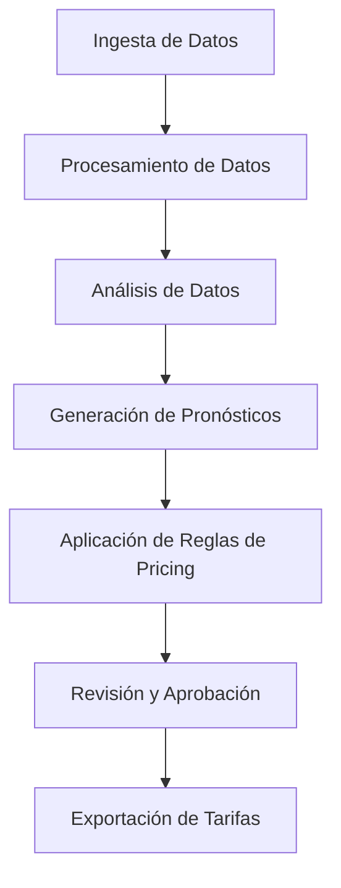

# Flujo de Datos

## Visión General

Este documento describe el flujo de datos en el Framework de Revenue Management, desde la ingesta de datos hasta la exportación de tarifas.

## Diagrama de Flujo

## Etapas del Flujo de Datos

### 1. Ingesta de Datos

La ingesta de datos es el primer paso en el flujo de datos. En esta etapa, se importan datos desde archivos Excel y se procesan para su almacenamiento en la base de datos.

#### Fuentes de Datos

- **Reservas**: Archivo Excel con datos de reservas históricas.
- **Estancias**: Archivo Excel con datos de estancias históricas.
- **Resumen Diario**: Archivo Excel con datos de resumen diario histórico.

#### Proceso de Ingesta

1. **Lectura de Archivos**: Se leen los archivos Excel utilizando la clase `ExcelReader`.
2. **Limpieza de Datos**: Se limpian y normalizan los datos utilizando la clase `DataCleaner`.
3. **Mapeo de Datos**: Se mapean los datos a modelos utilizando la clase `DataMapper`.
4. **Persistencia**: Se guardan los datos en la base de datos utilizando la clase `DataIngestionService`.

### 2. Procesamiento de Datos

En esta etapa, se procesan los datos importados para calcular métricas diarias de ocupación e ingresos.

#### Cálculo de Ocupación Diaria

1. **Expansión de Reservas**: Se expanden las reservas a noches individuales utilizando el método `expand_booking_to_nights`.
2. **Cálculo de Ocupación**: Se calcula la ocupación diaria utilizando el método `calculate_daily_occupancy`.
3. **Persistencia**: Se guardan los datos de ocupación diaria en la base de datos.

#### Cálculo de Ingresos Diarios

1. **Cálculo de Ingresos**: Se calculan los ingresos diarios a partir de las reservas y estancias.
2. **Cálculo de ADR**: Se calcula el Average Daily Rate (ADR) dividiendo los ingresos entre las habitaciones ocupadas.
3. **Cálculo de RevPAR**: Se calcula el Revenue Per Available Room (RevPAR) dividiendo los ingresos entre las habitaciones disponibles.
4. **Persistencia**: Se guardan los datos de ingresos diarios en la base de datos.

### 3. Análisis de Datos

En esta etapa, se analizan los datos procesados para calcular KPIs y detectar patrones.

#### Cálculo de KPIs

1. **Carga de Datos**: Se cargan los datos de ocupación e ingresos diarios desde la base de datos.
2. **Cálculo de KPIs**: Se calculan los KPIs utilizando el método `calculate_kpis` de la clase `KpiCalculator`.
3. **Agregación de KPIs**: Se agregan los KPIs por tipo de habitación, fecha o ambos utilizando el método `calculate_aggregated_kpis`.

#### Análisis de Patrones

1. **Análisis de Ocupación**: Se analizan los patrones de ocupación utilizando el método `analyze_occupancy_patterns`.
2. **Comparación YoY**: Se calcula la comparación año contra año utilizando el método `calculate_yoy_comparison`.

### 4. Generación de Pronósticos

En esta etapa, se generan pronósticos de ocupación y tarifa para fechas futuras.

#### Preparación de Datos

1. **Carga de Datos**: Se cargan los datos históricos desde la base de datos.
2. **Preparación para Prophet**: Se preparan los datos para el modelo Prophet utilizando el método `prepare_data` de la clase `ForecastService`.

#### Generación de Pronósticos

1. **Entrenamiento del Modelo**: Se entrena el modelo Prophet con los datos históricos.
2. **Generación de Pronósticos**: Se generan pronósticos para fechas futuras utilizando el método `generate_forecast`.
3. **Persistencia**: Se guardan los pronósticos en la base de datos utilizando el método `save_forecast_to_db`.

#### Actualización de KPIs

1. **Cálculo de ADR Previsto**: Se calcula el ADR previsto a partir de datos históricos.
2. **Cálculo de RevPAR Previsto**: Se calcula el RevPAR previsto a partir del ADR previsto y la ocupación prevista.
3. **Persistencia**: Se actualizan los KPIs de pronósticos en la base de datos utilizando el método `update_forecast_kpis`.

### 5. Aplicación de Reglas de Pricing

En esta etapa, se aplican reglas de pricing para generar recomendaciones de tarifas.

#### Carga de Datos

1. **Carga de Pronósticos**: Se cargan los pronósticos desde la base de datos.
2. **Carga de Reglas**: Se cargan las reglas de pricing desde la base de datos.

#### Aplicación de Reglas

1. **Preparación de Datos**: Se preparan los datos para aplicar reglas utilizando el método `_prepare_data_for_rules` de la clase `PricingRuleEngine`.
2. **Aplicación de Reglas**: Se aplican las reglas de pricing utilizando el método `apply_rules`.
3. **Cálculo de Tarifas**: Se calculan las tarifas recomendadas utilizando el método `_calculate_final_rates`.
4. **Generación de Recomendaciones**: Se generan recomendaciones de tarifas utilizando el método `generate_recommendations`.
5. **Persistencia**: Se guardan las recomendaciones en la base de datos utilizando el método `save_recommendations`.

### 6. Revisión y Aprobación

En esta etapa, el usuario revisa y aprueba las recomendaciones de tarifas.

#### Revisión de Recomendaciones

1. **Carga de Recomendaciones**: Se cargan las recomendaciones desde la base de datos.
2. **Visualización**: Se muestran las recomendaciones en la interfaz de usuario.
3. **Edición**: El usuario puede editar las tarifas recomendadas.

#### Aprobación de Tarifas

1. **Aprobación**: El usuario aprueba las tarifas.
2. **Persistencia**: Se actualizan las recomendaciones en la base de datos con el estado "Aprobada".

### 7. Exportación de Tarifas

En esta etapa, se exportan las tarifas aprobadas a un archivo Excel para su importación en el PMS Zeus.

#### Exportación a Excel

1. **Carga de Tarifas Aprobadas**: Se cargan las tarifas aprobadas desde la base de datos.
2. **Generación de Excel**: Se genera un archivo Excel con las tarifas aprobadas utilizando el método `export_to_excel` de la clase `TariffExporter`.
3. **Actualización de Estado**: Se actualiza el estado de las tarifas en la base de datos como "Exportadas".

## Conclusión

El flujo de datos en el Framework de Revenue Management es un proceso completo que abarca desde la ingesta de datos hasta la exportación de tarifas. Cada etapa del proceso está diseñada para proporcionar información valiosa y recomendaciones precisas para la gestión de ingresos del hotel.